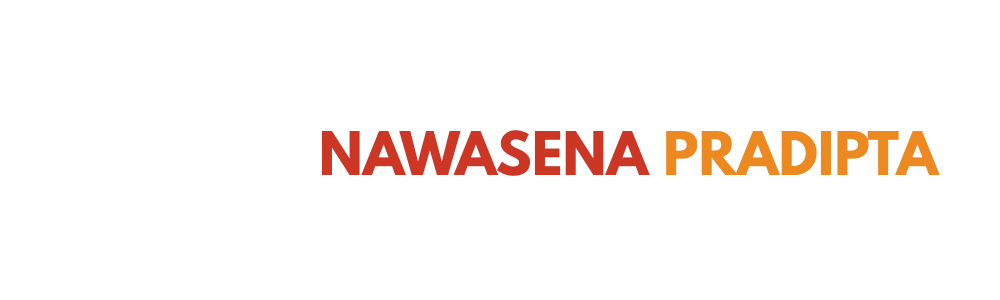

# 🚀 Panduan Teknis Developer (Workflow)

Dokumen ini panduan cepat buat kamu yang mau lanjutin coding atau update konten.
Ikuti urutan langkah di bawah ini biar nggak error!

---

## 1️⃣ Langkah Pertama (Habis Download/Clone)

Kalau kamu baru aja download file ZIP atau nge-*clone* dari GitHub, folder project ini masih "mentah".
Lakukan ini dulu di terminal (VS Code):

```bash
# 1. Masuk ke foldernya (kalau belum)
cd nama-folder-project

# 2. Install mesin & library-nya
npm install
git status
```
Tunggu sampai selesai. Kalau muncul folder node_modules, berarti sukses.


## 2️⃣ Setup File Rahasia (.env)
>⚠️ PENTING: File .env sengaja tidak di-upload ke GitHub demi keamanan. Kamu harus bikin sendiri manual.
1. Buat file baru bernama .env di folder paling luar (root)
2. Isi dengan kunci/config (Minta isi lengkapnya ke kating/admin sebelumnya).
3. Contoh isinya biasanya seperti ini: 
```env
VITE_API_KEY=minta-ke-admin
VITE_AUTH_DOMAIN=...
```
*Tanpa file ini website ga akan jalan bro. Tanya ke dev sebelumnya.*

## 3️⃣ Mulai Ngoding (Development Mode)
Biar setiap kali kamu save codingan, website-nya langsung update otomatis:
```bash
npm run dev
```
## 4️⃣ Bungkus Project (Build)
Kalau sudah selesai ngoding dan mau di-upload, kamu wajib "membungkus" codingan biar file-nya rapi dan ringan (terutama CSS Tailwind-nya).
Jalankan perintah ini:
```bash
npm run build
```

*Perintah ini akan memperbarui file output.css atau folder dis*t/ dengan versi terbaru.

## 5️⃣ Upload Perubahan (Push ke GitHub)
Sudah selesai semua? Jangan lupa simpan kerjaanmu ke "Awan" (GitHub) biar nggak hilang.

#### Urutan Mantra Git:
1. Cek status dulu (Pastikan `.env` ga warna merah/ikut ke-upload):
   ```bash
   git status
   ```
2. Angkut semua perubahan:
   ```bash
   git add .
   ```
3. Kasih label (Wajib jelas):
   ```bash
   git commit -m "P NGOPIII"
   ```
4. Kirim ke GitHub:
   ```bash
   git push
   ```

   > Catatan: Kalau pas git push gagal, biasanya karena ada temen lain yang update duluan. Solusinya: Ketik git pull dulu, baru git push lagi.

---

## 📜 Warisan & Credits
Panduan dan sistem ini adalah warisan dan dedikasi dari :

<div align="center">
  
  <br>
  
  
  <p><em>Sengaja kami buat terdokumentasi rapi biar kalian yang melanjutkan perjuangan ini nggak kebingungan.<br>
  Kalau ada error atau bingung soal logic, silakan cek <strong>Contributors</strong> atau tanya ke demisioner tahun periode 25/26.</em></p>
  
  <br>
  <p>🔥 <strong>Estafet perjuangan tidak boleh berhenti. Teruskan semangat ini, Filkomers!</strong> 🔥</p>
</div>
